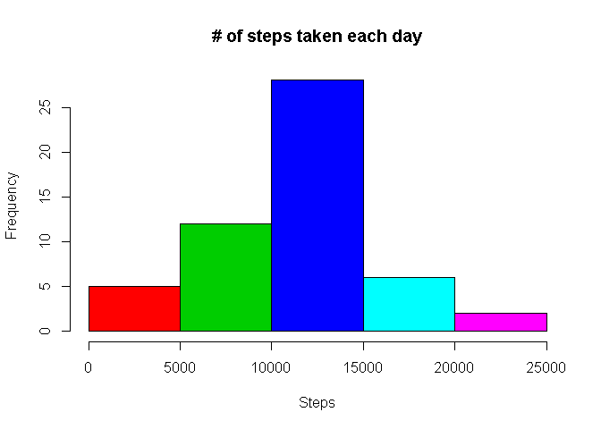
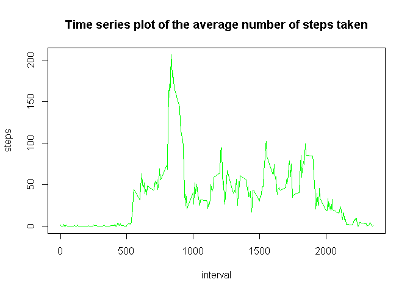
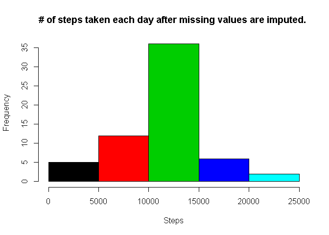
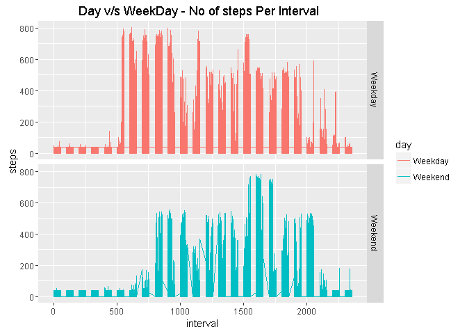

# Activity Log Assignment By Jaymin Barot
## Date :- May/14/2016
### This markdown file contais the assigment for the Coursera project Reproducible Research using Activity monitoring data.

Question
========
1. What is mean total number of steps taken per day?

Answer
======
 
 
 # 3 Mean and median number of steps taken each day
 
 1. Code for reading in the dataset and/or processing the data

```r
setwd("C:/Jaymin/Data_Science/Assignment/repdata-data-activity")
if(!file.exists("Activity")){
  url<-"https://d396qusza40orc.cloudfront.net/repdata%2Fdata%2Factivity.zip"
  download.file(url = url,destfile = "./Activity.zip" )
  unzip("Activity.zip")
}
My_data <- read.csv("activity.csv")
```
2. Histogram of the total number of steps taken each day


```r
Per_Day_Steps <- aggregate(steps~date, data=My_data,sum)
hist(Per_Day_Steps$steps,col = Per_Day_Steps$date,xlab = "Steps",ylab = "Frequency", main="# of steps taken each day")
```

<!-- -->

3. Mean and median number of steps taken each day


```r
mean(Per_Day_Steps$steps,na.rm = TRUE)
```

```
## [1] 10766.19
```

```r
median (Per_Day_Steps$steps,na.rm = TRUE)
```

```
## [1] 10765
```


Time series plot of the average number of steps taken


```r
Steps_Interval <- aggregate(steps ~ interval, data = My_data, mean, na.rm = TRUE)
plot(steps ~ interval, data = Steps_Interval, type = "l", main="Time series plot of the average number of steps taken",col="green")
```

<!-- -->

5. The 5-minute interval that, on average, contains the maximum number of steps


```r
Max_Step <- which.max(Steps_Interval$steps)
Steps_Interval[Max_Step,1]
```

```
## [1] 835
```

6. Code to describe and show a strategy for imputing missing data

Imputing column mean on NA

```r
# getting & printing missing data
missing_value_activity <- My_data[!complete.cases(My_data), ]
nrow(missing_value_activity)
```

```
## [1] 2304
```

```r
# getting column mean 
JcolMean <- colMeans(as.data.frame(My_data$steps),na.rm = TRUE)

# Replacing NA with column mean
My_data<- as.data.frame(My_data)
My_data[is.na(My_data)]<-JcolMean

missing_value_activity_check <- My_data[!complete.cases(My_data), ]
nrow(missing_value_activity_check)
```

```
## [1] 0
```

7. Histogram of the total number of steps taken each day after missing values are imputed


```r
Per_Day_Steps <- aggregate(steps~date, data=My_data,sum)
hist(Per_Day_Steps$steps,col = Per_Day_Steps$date,xlab = "Steps",ylab = "Frequency", main="# of steps taken each day after missing values are imputed. ")
```

<!-- -->


8. Panel plot comparing the average number of steps taken per 5-minute interval across weekdays and weekends


```r
week_day <- function(date_val) {
    wd <- weekdays(as.Date(date_val, '%Y-%m-%d'))
    if  (!(wd == 'Saturday' || wd == 'Sunday')) {
        x <- 'Weekday'
    } else {
        x <- 'Weekend'
    }
    x
}
library(ggplot2)
My_data$day  <- as.factor(sapply(My_data$date, week_day))

gp<- ggplot(data=My_data,aes(interval,steps)) + geom_line(stat = "identity",aes(colour = day)) + facet_grid(day ~ .,scales = "fixed",space = "fixed")+ ggtitle("Day v/s WeekDay - No of steps Per Interval  ")

gp
```

<!-- -->


